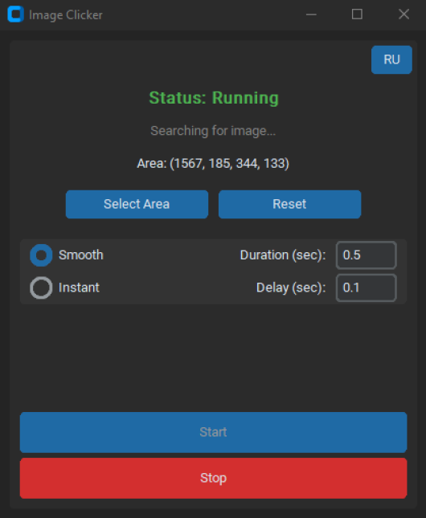
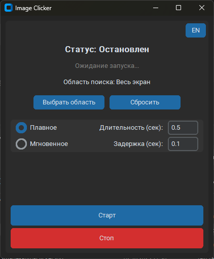

# Image Auto-Clicker GUI


Easy-to-use GUI auto-clicker that finds and clicks on-screen images.

---

### Screenshot



---

### Key Features

*   **Modern & User-Friendly GUI:** An intuitive interface built with CustomTkinter.
*   **Selectable Search Area:** Scan the entire screen or select a specific region with your mouse to increase performance and accuracy.
*   **Dynamic Image Loading:** Automatically loads all `.png`, `.jpg`, and `.jpeg` images from the `img` folder.
*   **Customizable Mouse Movement:** Choose between "Smooth" movement (human-like) or "Instant" clicks.
*   **External Configuration:** All settings are saved in a `config.ini` file for easy modification.
*   **Multi-Language Support:** Switch between English and Russian.
*   **Robust Logging:** Keeps a detailed log of all actions and errors in `Image-auto-clicker.log`.

---

### How It Works

The application operates in a simple loop:
1.  Takes a screenshot of the specified screen area.
2.  Compares the screenshot with the image templates loaded from the `img` folder.
3.  If a match is found with a high enough confidence level, it moves the mouse to the center of the image and clicks.

---

### Getting Started

You can either download the ready-to-use application or run it from the source code.

#### Option 1: Quick Start (Recommended for most users)

No installation or Python required.

1.  Go to the [**Releases Page**](https://github.com/1Stalk/Image-Auto-Clicker-GUI/releases).
2.  Download the latest `.zip` archive.
3.  Unzip the archive to any folder.
4.  Run the `ImageAutoClicker.exe` file.

#### Option 2: Running from Source (For developers)

This method requires Python and dependencies to be installed.

1.  **Prerequisites:**
    *   Python 3.7+

2.  **Clone the repository:**
    ```sh
    git clone https://github.com/1Stalk/Image-Auto-Clicker-GUI.git
    cd Image-Auto-Clicker-GUI
    ```

3.  **Install dependencies:**
    It's highly recommended to use a virtual environment.

    ```sh
    python -m venv venv
    venv\Scripts\activate
    ```

    ```sh
    pip install -r requirements.txt
    ```

4.  **Run the application:**
    ```sh
    python Image-Auto-Clicker.py
    ```

---

### Usage Guide

1.  **Add Images:** Place the images you want the script to find into the `img` folder. The app will create this folder on first launch if it doesn't exist.
2.  **Launch the App:** Run the `.exe` or the Python script.
3.  **Select Area (Optional):** Click the "Select Area" button to draw a rectangle on the screen. The search will be confined to this area. Click "Reset" to go back to full-screen search.
4.  **Configure Settings:**
    *   Choose your preferred mouse movement style ("Smooth" or "Instant").
    *   Adjust the duration/delay values as needed.
5.  **Start Clicking:** Press the "Start" button to begin the automation.
6.  **Stop Clicking:** Press the "Stop" button at any time to halt the process.

---

### Building from Source

If you want to build the executable (`.exe`) yourself, follow these steps:

1.  **Complete the setup** for "Running from Source" (clone the repo, install dependencies).
2.  **Install PyInstaller:**
    ```sh
    pip install pyinstaller
    ```
3.  **Run the build command** from the root directory of the project:
    ```sh
    pyinstaller --name ImageAutoClicker --windowed Image-Auto-Clicker.py
    ```
4.  Your finished executable will be located in the `dist/ImageAutoClicker` folder.

---

### Configuration (`config.ini`)

The application automatically creates a `config.ini` file to store your settings. You can edit it manually if needed.

| Parameter          | Description                                                                 | Default Value |
| ------------------ | --------------------------------------------------------------------------- | ------------- |
| `image_folder`     | The folder where your template images are stored.                           | `img`         |
| `threshold`        | The confidence level for a match (0.0 to 1.0). Higher is stricter.          | `0.8`         |
| `post_click_delay` | The delay (in seconds) after a successful click before searching again.     | `2.6`         |
| `idle_delay`       | The delay (in seconds) between searches when no image is found.             | `0.5`         |
| `language`         | The default language for the interface (`en` or `ru`).                      | `en`          |

---

### Acknowledgements

This project was inspired by the simple and effective command-line script created by [2cz5](https://github.com/2cz5). The core image recognition logic is based on their original work.

---

### License

This project is licensed under the MIT License - see the [LICENSE](LICENSE) file for details.

<br>

<details>
<summary><strong>Русская версия (Russian Version)</strong></summary>

# Image Auto-Clicker GUI


Простой GUI-автокликер, который находит и нажимает на изображения на экране.

---

### Скриншот



---

### Ключевые возможности

*   **Современный и удобный GUI:** Интуитивно понятный интерфейс, созданный с помощью CustomTkinter.
*   **Выбор области поиска:** Сканируйте весь экран или выделите определенную область мышью, чтобы повысить производительность и точность.
*   **Динамическая загрузка изображений:** Автоматически загружает все изображения (`.png`, `.jpg`, `.jpeg`) из папки `img`.
*   **Настраиваемое движение мыши:** Выбирайте между "Плавным" (имитация человека) и "Мгновенным" перемещением.
*   **Внешний файл конфигурации:** Все настройки сохраняются в `config.ini` для удобного редактирования.
*   **Поддержка нескольких языков:** Переключайтесь между английским и русским языком.
*   **Детальное логирование:** Ведет журнал всех действий и ошибок в файле `Image-auto-clicker.log`.

---

### Как это работает

Приложение работает в простом цикле:
1.  Делает скриншот указанной области экрана.
2.  Сравнивает скриншот с шаблонами изображений, загруженными из папки `img`.
3.  Если совпадение найдено с достаточным уровнем точности, перемещает курсор в центр изображения и выполняет клик.

---

### Установка и запуск

Вы можете скачать готовую программу или запустить ее из исходного кода.

#### Вариант 1: Быстрый старт (Рекомендуется для большинства пользователей)

Не требует установки Python и зависимостей.

1.  Перейдите на [**страницу релизов**](https://github.com/1Stalk/Image-Auto-Clicker-GUI/releases).
2.  Скачайте последнюю версию архива `.zip`.
3.  Распакуйте архив в любую папку.
4.  Запустите файл `ImageAutoClicker.exe`.

#### Вариант 2: Запуск из исходного кода (Для разработчиков)

Этот способ требует установленного Python и зависимостей.

1.  **Требования:**
    *   Python 3.7+

2.  **Клонируйте репозиторий:**
    ```sh
    git clone https://github.com/1Stalk/Image-Auto-Clicker-GUI.git
    cd Image-Auto-Clicker-GUI
    ```

3.  **Установите зависимости:**
    Настоятельно рекомендуется использовать виртуальное окружение.

    ```sh
    python -m venv venv
    venv\Scripts\activate
    ```

    ```sh
    pip install -r requirements.txt
    ```

4.  **Запустите приложение:**
    ```sh
    python Image-Auto-Clicker.py
    ```

---

### Руководство по использованию

1.  **Добавьте изображения:** Поместите изображения, которые должен находить скрипт, в папку `img`. Программа создаст эту папку при первом запуске, если она отсутствует.
2.  **Запустите приложение:** Запустите `.exe` файл или Python-скрипт.
3.  **Выберите область (необязательно):** Нажмите кнопку "Выбрать область", чтобы нарисовать прямоугольник на экране. Поиск будет ограничен этой областью. Нажмите "Сбросить", чтобы вернуться к поиску по всему экрану.
4.  **Настройте параметры:**
    *   Выберите предпочтительный стиль движения мыши ("Плавное" или "Мгновенное").
    *   При необходимости отрегулируйте значения длительности/задержки.
5.  **Начните работу:** Нажмите кнопку "Старт", чтобы запустить автоматизацию.
6.  **Остановите работу:** Нажмите кнопку "Стоп" в любой момент, чтобы прервать процесс.

---

### Сборка из исходного кода

Если вы хотите самостоятельно собрать исполняемый файл (`.exe`), выполните следующие шаги:

1.  **Выполните подготовку** для "Запуска из исходного кода" (клонируйте репозиторий, установите зависимости).
2.  **Установите PyInstaller:**
    ```sh
    pip install pyinstaller
    ```
3.  **Выполните команду для сборки** из корневой папки проекта:
    ```sh
    pyinstaller --name ImageAutoClicker --windowed Image-Auto-Clicker.py
    ```
4.  Готовый исполняемый файл будет находиться в папке `dist/ImageAutoClicker`.

---

### Конфигурация (`config.ini`)

Приложение автоматически создает файл `config.ini` для хранения ваших настроек. При необходимости вы можете редактировать его вручную.

| Параметр           | Описание                                                                  | Значение по умолчанию |
| ------------------ | ------------------------------------------------------------------------- | --------------------- |
| `image_folder`     | Папка, в которой хранятся ваши изображения-шаблоны.                       | `img`                 |
| `threshold`        | Уровень уверенности для совпадения (от 0.0 до 1.0). Чем выше, тем строже. | `0.8`                 |
| `post_click_delay` | Задержка (в секундах) после успешного клика перед следующим поиском.      | `2.6`                 |
| `idle_delay`       | Задержка (в секундах) между циклами поиска, когда изображение не найдено.  | `0.5`                 |
| `language`         | Язык интерфейса по умолчанию (`en` или `ru`).                             | `en`                  |

---

### Благодарности

Этот проект был вдохновлен простым и эффективным консольным скриптом от пользователя [2cz5](https://github.com/2cz5). Базовая логика поиска изображений основана на его первоначальной работе.

---

### Лицензия

Этот проект распространяется под лицензией MIT - подробности смотрите в файле [LICENSE](LICENSE).

</details>